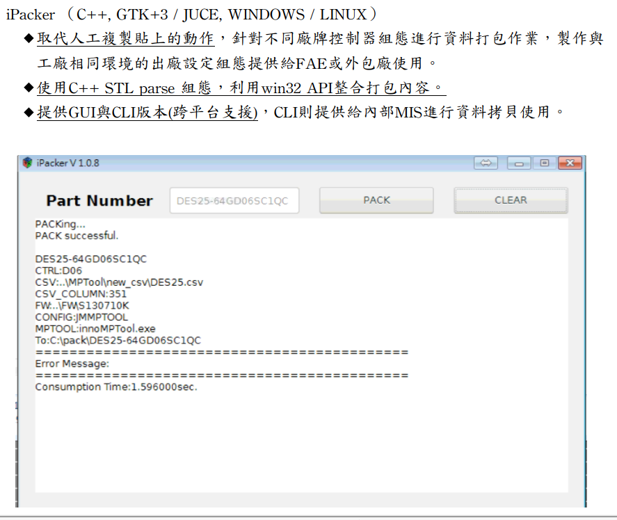

# innodisk | 2017
- Software develop engineer | 01-12  

### Responsibilities:

- Developed and maintained factory-side production software for internal use.
- Created software solutions for automation.
- Established a universal library on the development side.
- Implemented version control.
### Experience in the Job:

- Established a software development environment.
- Developed desktop applications (GUI / CLI) from scratch.
- Cross-platform development experience on Windows 7 and Ubuntu 16.04.
- Proficient in data structures, continuously analyzing input data using vectors and strings for error prevention and automation.
- Implemented parallel processing using multithreading to concurrently execute tests on multiple devices.
- Familiar with Win32 API, CreateFile, and DeviceIoControl.
- Proficient in SQL syntax for CRUD (Create, Read, Update, Delete) operations.
- Utilized version control systems including trunk (master), branch, and tag.
- Conducted unit testing with tools like JUCE and CATCH2.
- Conducted vendor command testing.
- Performed SATA/USB disk testing.
- Collaborated with MIS projects to integrate data through RESTful APIs, providing automation solutions.
### Skills
- Programming language: C/C++
- Compiler: gcc/g++ / MSVC
- GUI: mfc / gtk3.0 / JUCE
- Version control: SVN / GIT
- DataBase: SQLite3, MariaDB

### Project list
Platform | Name | Skills | img
--- | --- | --- | ---
Win, Linux | iPacker | C, gtk3.0, SVN | 
Win | QCheck | C++, JUCE, SVN, MariaDB |  
Win | SNBinding | C++, JUCE, SVN
Win | iSB | C++, JUCE, SVN
Win | iDIO | C++, MFC, SVN | 
Linux | FIO Wrapper test with GUI | C++, JUCE, GIT, SQLite3 |  

### Library list
1. SATA Port Number Configuration (Windows)

2. Configuration File Retrieval (Windows)

3. Web API Data Retrieval (Windows)

4. Common GUI Development (Windows)

5. SSD device Read/Write Functionality (Windows)

6. Vendor Command Implementation (Windows / Linux)

7. Library Development (Windows / Linux)

    - Libipacker: iPacker core functionality provided as a library.

    - Libqcheck: QCheck core functionality provided as a library.

    - LibinnoDio: Peripheral card library with a C++ interface.

    - Libdm: Windows device management, retrieving device information from Computer Management.

