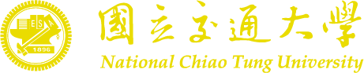
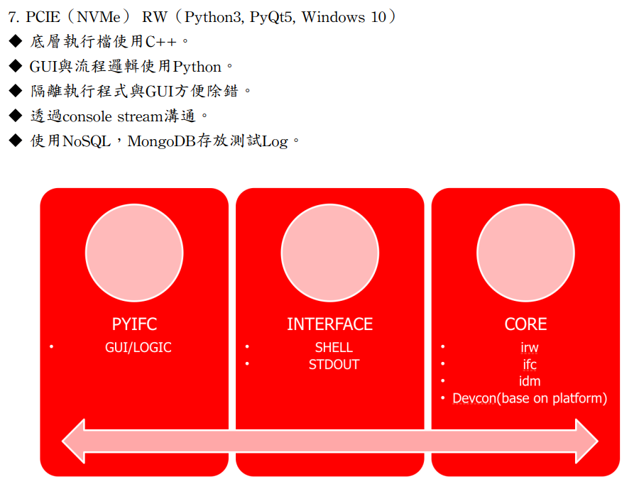
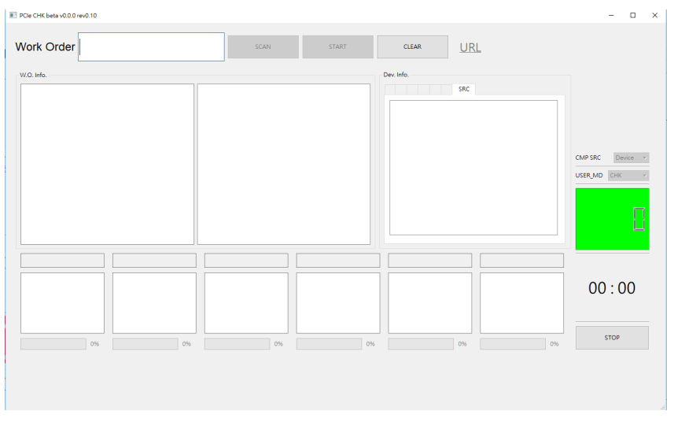
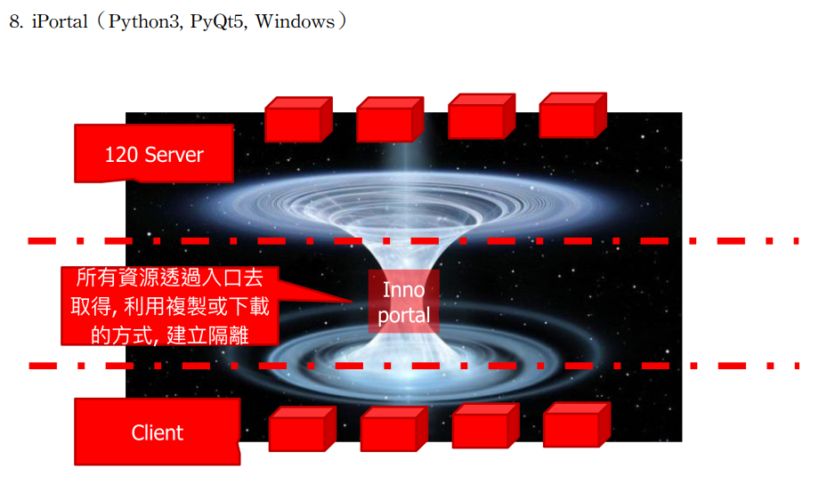
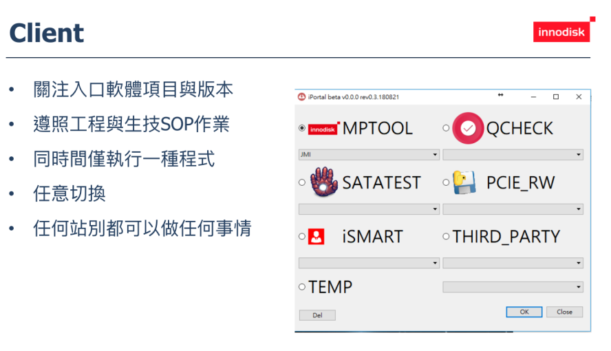

  

# 2018
> Admitted to NCTU in CS 
>  
- Senior software develop enginner, 08-12  
- Master's student, 09-12  
  - Computer architecture a quantitative approach
    - [The final project] paper present, "Parallel implementation of ann training present"
  - Neural network

### Responsibilities
- 物聯網
- 雲端架構
- 智慧工廠
- 新人求生指南教練

### Experience in the job
- NVMe disk測試, PCIE介面硬體位置判斷與熱插拔解決方案.
- 打造新人求生指南,縮短學習與探索時間,嘗試透過不一樣的教育訓練,提升效率.(成效:有經驗的新人可在三個月內獨立完成專案.)
- Study SMART Factory 智慧工廠.
- 從資料庫數據分析使用者行為,改良與優化生產流程. 從資料可以推翻透過人工口耳相傳的Error現象,例如:人工斷定程式Bug,但實際上錯誤地使用流程.
- 進階資料庫操作. 使用view檢視表進行反正歸化整理,協助產品工程師分析異常,並分類原因.
- 開發軟體入口, 解決client與server之間的耦合性,並可以更彈性的調整測試機台的軟體使用以及介面管理.

### Skills
- Programming language: python(CPython), html, SQL
- GUI: pyqt5
- DataBase: mongoDB
- Web deveolpe: Flask(RESTFul API), socket programming

### Project list
Platform | Name | Skills | img
--- | --- | --- | ---
Win | PCIE RW | C++, Python3, PyQt5, git, mongoDB |  
Win | iportal | Python3, PyQt5, SVN |  
Web | Log download center | Python3, Flask, git, mongoDB | 

